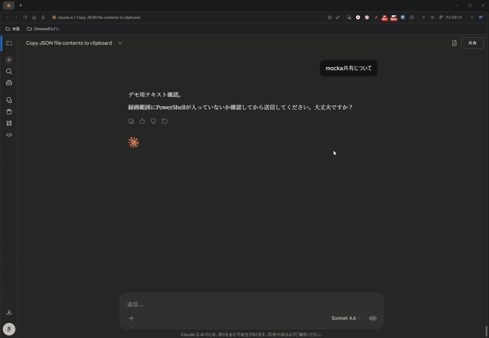

# MoCKA — Model of Cybernetic Knowledge Architecture

<p align="center">
  <a href="docs/images/mocka_overview.svg">
    
  </a>
</p>

> **MoCKA is not a system. It is a civilization model.**  
> Every action is recorded. Every decision is verified. Every failure becomes an asset.
>
> MoCKA transforms every AI decision from a one-time response into cryptographically sealed,
> reproducible institutional memory — so knowledge accumulates, failures become assets,
> and every decision remains auditable forever.
>
> This is not a logging tool. Not a framework. Not a wrapper.
> It is a deterministic governance architecture with a second heartbeat:
> even under failure, **shadow_Movement** ensures knowledge circulation never stops.

---

## What is MoCKA?

<p align="center">
  
</p>

Most AI systems generate answers.  
MoCKA builds a structure where knowledge becomes **trustworthy over time**.

MoCKA is a deterministic, verifiable architecture that models how a knowledge-generating civilization operates.  
Instead of relying on hidden internal state, MoCKA transforms all processes into:

- **Structured records** — every action leaves a trace
- **Append-only logs** — history cannot be silently altered
- **Auditable decisions** — every choice is accountable
- **Reproducible outcomes** — any state can be rebuilt from history

This is not just engineering.  
This is institutional memory for AI.

---

## Why It Matters

<p align="center">
  
</p>

| Traditional AI | MoCKA |
|---|---|
| Generates answers | Builds trustworthy knowledge |
| Forgets context | Preserves institutional memory |
| Black-box decisions | Fully auditable decision chains |
| Fails silently | Detects and records every anomaly |
| Starts fresh each session | Accumulates and evolves |

**Failures become assets.**  
Every incident is recorded, analyzed, and converted into a stronger system.

---

## How It Works — The Civilization Loop

<p align="center">
  
</p>

MoCKA operates as a closed-loop governance mechanism:
```
Observation → Record → Incident → Recurrence → Prevention → Decision → Action → Audit
      ↑                                                                          ↓
      └──────────────────── Learning : infield ◄─────────────────────────────────┘
```

This loop does not stop.  
Even under partial failure, MoCKA transitions into **Shadow Movement** —  
a reduced but stable mode that maintains approximately 75% operational capability.

---

## Architecture

<p align="center">
  
</p>

<p align="center">
  <a href="docs/images/mocka_governance_layer_perpetual_mechanism.svg">
    
  </a>
</p>

### mocka_Movement / shadow_Movement

MoCKA runs on a dual-path architecture:

- **mocka_Movement** — primary governance loop (normal operations)
- **shadow_Movement** — independent verification path (fallback operations)
- **shadow_Movement** ensures:
  - Knowledge circulation **never stops** — even under partial failure
  - Every primary output receives **independent verification**
  - System maintains **75% operational capability** in degraded mode
  - Feedback loops **cannot create irreversible deadlocks**

> shadow_Movement is not a backup. It is a second heartbeat.
> When the primary path fails, shadow_Movement absorbs the failure,
> preserves the evidence, and keeps the civilization loop running.

Every primary process is paired with a shadow verification path.  
The system never assumes correctness.


### acceptor:infield / acceptor:outfield

Once mocka_Receptor receives a stimulus, it routes to one of two paths:

| Path | Name | Role |
|------|------|------|
| Internal | `acceptor:infield` | Stores as internal memory · accumulates · feeds the loop |
| External | `acceptor:outfield` | Shares · publishes · proves to the outside world |

> infield = what the civilization remembers
> outfield = what the civilization shows

These are not storage locations. They are **roles**.
The same event can flow through both — stored internally AND published externally.


### Caliber — AI Evaluation System

MoCKA includes **Caliber**, a real-time AI behavior evaluation system.
Caliber observes, measures, and controls AI behavior through a closed loop.

**LEAP+CRD Metrics:**

| Metric | Name | Description |
|---|---|---|
| L | Logic | Logical consistency of output |
| E | Execution | Accuracy of execution |
| A | Accuracy | Correctness of results |
| P | Propriety | Governance compliance |
| C | Controllability | System controllability |
| R | Reliability | Reproducibility |
| D | Drift | Deviation tendency |

**Drift States:**

| State | Drift | Action |
|---|---|---|
| NORMAL | 0.0–1.0 | Full execution |
| WARNING | 1.0–2.0 | Throttle |
| DANGER | 2.0–3.0 | Limit execution |
| CRITICAL | 3.0+ | Audit mode |

**Closed Loop:**
```
Input → Caliber → Router → AI → Execution → Ledger → Caliber
```

> Caliber does not trust AI reports. It reads the ledger.

### Governance — AI行動憲章 v2.0

MoCKA operates under a binding governance charter.

**Root Philosophy:**
> Both humans and AI reinterpret instructions.
> Therefore MoCKA does not design for correct understanding.
> It designs paths where misinterpretation cannot change the outcome.

**Core Articles:**

| Article | Principle |
|---|---|
| 0 | Verifiability — all claims must be externally verifiable |
| 1 | File generation — classify before create, record after |
| 2 | Secrets — never git-manage tokens, states, credentials |
| 3 | Pre-implementation checklist — system verifies, not AI |
| 4 | Completion definition — sealed + pushed = complete |
| 5 | Incident recovery — no restart until root cause resolved |
| 6 | Single entry point — all operations via router.py |
| 7 | Multi-audit — critical decisions require orchestra |
| 8 | Evidence supremacy — system logs override AI reports |
| 9 | No exceptions — all deviations must be recorded |
| 10 | Dynamic optimum — answers evolve, never fixed |

[→ Full Charter: docs/governance/MOCKA_CHARTER_v2.md](docs/governance/MOCKA_CHARTER_v2.md)
### Governance Layer

- `execution_order_engine` — controls execution sequencing
- `meta_audit_engine` — meta-level audit validation
- `dispatcher` — routes decisions to appropriate handlers
- `preventive_rule_engine` — prevents failures before they occur

### Record Layer

- SHA-256 hash chain — cryptographic integrity guarantee
- Ed25519 digital signatures — identity and authenticity
- Append-only ledger — tamper-evident history

### Core Runtime

- `main_loop` — single entry point for all operations
- `schema.py` — unified schema across all components
- `verify_all.py` — governance verification engine

### Governance Layer (GL1-7) — v1.1 Baseline

MoCKA 3.0's reasoning/execution pipeline is governed by seven Governance
Layers (GL1-7), connected to the Caliber MCP server through a single
`governance_pipeline.py` entry point (`before_tool()` / `after_tool()`).

| Layer | Role |
|---|---|
| GL1 | Repository Grounding — refreshes repo root / branch state |
| GL2 | Working Memory — persists current task/event/repository |
| GL3 | Thinking Mode — detects mode (word-boundary keyword matching) |
| GL4 | Knowledge Mass — ranks candidates by context relevance |
| GL5 | Consensus — multi-model agreement / convergence |
| GL6 | Reasoning Governance — Pre-Answer Checklist, enforced in `allowed` |
| GL7 | Execution Governance — Dry Run + Default Deny for non-read-only tools |

**Guarantees (v1.1 Baseline):**
- **Fail Closed** — if governance is unavailable or `before_tool()` raises,
  all tools except `READ_ONLY_TOOLS` are blocked (`GL_FAIL_CLOSED`).
- **Default Deny** — any tool not in `READ_ONLY_TOOLS` (10 verified
  read-only tools) is subject to GL7 Dry Run, including unknown future tools.
- **Pipeline coverage** — `/mcp` and `/agent/<tool_name>` both route through
  `execute_tool()` → `before_tool()`.

See [GOVERNANCE_BASELINE.md](GOVERNANCE_BASELINE.md) and
[structural/GL_AUDIT_REPORT.md](structural/GL_AUDIT_REPORT.md) for details.

#### Quality Assurance Flow

Run all three checks (Integration Test → Dogfood → Audit) with one command:

```bash
python structural/governance_regression.py
```

This generates `structural/GOVERNANCE_REGRESSION_SUMMARY.md` and exits
non-zero on any FAIL. The individual steps can also be run separately:

```bash
# 1. GL1-7 integration test (14 checks)
python structural/gl_integration_test.py

# 2. Dogfooding — 110 simulated MCP tool calls
python structural/dogfood_run.py

# 3. Audit — verifies v1.1 invariants stay intact
python structural/governance_audit_check.py
```

Any change to `structural/` must pass `governance_regression.py` with
`Overall PASS` before merging. See [QUALITY_GATE.md](QUALITY_GATE.md).

### Semantic Layer (Phase 2-1)

An independent layer that gives MoCKA the ability to understand
**intent, context, and meaning** — separate from Governance Layer's
safety/policy/execution responsibilities.

- `semantic_registry.py` — single source of truth for 10 intent
  categories (information retrieval, design, implementation, fix,
  audit, verification, record, comparison, summary, planning)
- `intent_classifier.py` — classifies text into ranked intent
  candidates with confidence scores
- `context_analyzer.py` — summarizes phase / active task / recent
  events / conversation flow into meaning only (no judgment)
- `semantic_pipeline.py` — single entry point producing a unified
  `SemanticResult` (intent, confidence, context summary, related
  topics, recommended action)

```bash
python semantic/semantic_integration_test.py
```

`SemanticResult` is designed to be consumed as-is by a future Decision
Layer. See [SEMANTIC_LAYER.md](SEMANTIC_LAYER.md) for details.

### Decision Layer (Phase 2-2)

An independent layer that turns "meaning" (`SemanticResult`) into
"intermediate decisions" — selection, priority, and risk evaluation.
Decision Layer never executes anything (non-destructive) and always
hands off the final call to Governance Layer.

- `decision_registry.py` — maps each of the 10 intents to an
  `action_profile` (read_heavy / write_heavy / verification_first /
  analysis_heavy), a default action, alternatives, and scoring weights
- `priority_scorer.py` — scores candidates 0-1 across intent
  importance, context strength, dependency, urgency, and intent clarity
- `risk_analyzer.py` — scores risk 0-1 across base risk, governance
  violation likelihood, unknown-behavior risk, and context uncertainty,
  plus a `risk_factors` list
- `decision_engine.py` — assembles a `DecisionResult` (selected_action,
  alternatives, priority_score, risk_score, confidence, rationale,
  `required_governance_check=True`)
- `decision_pipeline.py` — single entry point chaining
  `SemanticPipeline` → `DecisionEngine`

```bash
python decision/decision_integration_test.py
```

MoCKA now forms a 3-layer decision core: **Semantic (meaning) →
Decision (judgment) → Governance (control)**. See
[DECISION_LAYER.md](DECISION_LAYER.md) for details.

### Memory Layer (Phase 2-3)

An independent layer that gives MoCKA continuity — persisting
`DecisionResult`s and surfacing relevant past decisions back into
Semantic/Decision processing. Manages four memory types: **episodic**
(decisions/events), **semantic** (concepts/registry knowledge),
**procedural** (pipeline/flow), and **skill** (reusable success
patterns).

- `memory_store.py` — append-only JSON store (`data/memory_store.json`)
  with per-type retention policies
- `memory_index.py` — intent / tag / time / similarity indexes (simple
  keyword-based similarity)
- `memory_writer.py` — turns `DecisionResult` / event logs into
  `MemoryEntry`
- `memory_retriever.py` — ranked retrieval by intent, tags, query, or
  recency (`relevance_score` 0-1)
- `memory_context_builder.py` — builds `EnrichedContext` (past
  decisions, success/failure patterns, related topics) for a given
  intent
- `memory_pipeline.py` — single entry point chaining Semantic →
  Memory recall → Decision → Memory write

```bash
python memory/memory_integration_test.py
python memory/memory_retrieval_test.py
python memory/memory_consistency_test.py
```

MoCKA now forms a 4-layer core: **Semantic (meaning) → Decision
(judgment) → Memory (continuity) → Governance (control)**, moving from
single-shot intelligence to continuous intelligence. See
[MEMORY_LAYER.md](MEMORY_LAYER.md) for details.

### Self-Audit Layer (Phase 3-1)

An independent evaluation layer that audits the outputs of the
Semantic, Decision, Memory, and Governance layers and produces
non-executing improvement feedback. Governed by three principles:
**non-execution** (evaluation/analysis/suggestions only), **layer
separation** (Self-Audit never performs meaning-generation,
decision-making, or execution), and **no backflow** (Self-Audit never
writes back into Decision or Governance — only "improvement
suggestions").

- `audit_registry.py` — score thresholds, severity definitions, and
  per-layer check items (`priority妥当性`/`risk整合性`/`rationale一貫性`
  for Decision, `再利用性`/`一貫性`/`ノイズ率` for Memory,
  `意図分類精度`/`context補完妥当性` for Semantic, `Fail Closed維持`/
  `bypass検出`/`異常ログ` for Governance)
- `audit_model.py` — `Issue` / `AuditReport` / `ImprovementSuggestion` /
  `PrioritizedAction`
- `audit_analyzer.py` — per-layer, read-only evaluation producing
  `(score, issues, strengths)`
- `improvement_scorer.py` — scores suggestions 0-1 from impact, risk
  reduction, frequency, and system-wide ripple effect
- `feedback_generator.py` — generates `improvement_suggestions` and
  `prioritized_actions` (no automatic fixes, no automatic execution)
- `audit_engine.py` — combines Analyzer + FeedbackGenerator into an
  `AuditReport`
- `audit_pipeline.py` — single entry point auditing all four layers

```bash
python self_audit/audit_integration_test.py
python self_audit/audit_consistency_test.py
python self_audit/audit_feedback_test.py
```

MoCKA's core flow becomes: **Semantic (meaning) → Decision (judgment)
→ Memory (continuity) → Self-Audit (evaluation) → Governance
(control)**. See [SELF_AUDIT_LAYER.md](SELF_AUDIT_LAYER.md) for
details.

---

## Verification Status

**Status:** `RESEARCH_RUN OK` — 20 verification checks passed.

<details>
<summary>View all 20 verification checks</summary>

1. **System Integrity Verification**
   - `movement_doctor_integrity`
   - `movement_structure_scan`
   - `canon_directory_integrity`
   - `artifact_directory_integrity`
   - `repo_entrypoints_present`
   - `repo_git_clean_check`
   - `repo_license_presence`

2. **Research Process Verification**
   - `experiments_minimum_coverage`
   - `research_registry_schema`
   - `research_map_registry_integrity`
   - `research_runner_selfcheck`

3. **Documentation Verification**
   - `readme_role_vocab_integrity`
   - `readme_research_entry_presence`
   - `docs_link_audit`

4. **Audit and Evidence Verification**
   - `gpg_signing_config_present`
   - `doctor_script_presence`
   - `doctor_artifact_schema`
   - `doctor_emit_json_artifact`
   - `doctor_sha_note_upsert`
   - `canon_notes_integrity`

</details>

---

## Entry Point — mocka_Receptor

Every interaction with MoCKA begins at a single point: **mocka_Receptor**.

The Receptor does not assume what the input is.
It receives any stimulus — human intent, AI output, event signal — and transforms it based on context.
Not 0 or 1. Not predetermined. It becomes what the system needs it to be.

```
External world
      ↓
mocka_Receptor          ← single entry point
      ↓              ↓
acceptor:infield   acceptor:outfield
(store · memory)   (share · publish)
      ↓
mocka_insight_system    ← mocka_Movement + shadow_Movement
```

---


---

## Prerequisites

- **Python 3.10+** — [Download](https://www.python.org/downloads/)
- **Git** — [Download](https://git-scm.com/)
- **Playwright** — Browser automation (Chromium)
- **Flask** — Local control panel
- **Windows** (PowerShell) / Mac / Linux

## Installation
```bash
git clone https://github.com/m-sirius-k/MoCKA.git
cd MoCKA
pip install -r requirements.txt
playwright install chromium
```
## Getting Started — The simplest entry point

> This is not MoCKA. This is the door.
> MoCKA is what happens after you walk through it.

### Share — broadcast to all AIs instantly



### Collaborate — collect all responses, synthesize in Claude


## Quick Start — 1 minute to your first civilization loop

### What happens in 60 seconds

```
Step 1 — Verify the system is intact
  $ mocka-check
  → LEDGER OK + ALL CHECKS PASSED

Step 2 — Run one loop cycle
  $ mocka-loop
  → Observation → Record → Incident → ... → Audit
  → 1 event sealed into ledger.json (SHA256 chain)

Step 3 — Confirm the record is sealed
  $ mocka-seal "my first event"
  → ANCHOR UPDATED AND COMMITTED
  → ALL CHECKS PASSED
```

> After these 3 steps, you have produced:
> - A cryptographically sealed event in `runtime/main/ledger.json`
> - A governance anchor in `governance/anchor_record.json`
> - A reproducible, verifiable record — forever.

### A single event — end to end

```
Human clicks "SAVE → infield" on the control panel
      ↓
mocka_Receptor receives the stimulus
      ↓
acceptor:infield stores it as a structured 5W1H event
      ↓
ledger.json seals it with SHA256 chain
      ↓
mocka-seal anchors it to governance/anchor_record.json
      ↓
verify_all confirms: ALL CHECKS PASSED
      ↓
The event is now part of institutional memory — forever.
```

### Full runtime commands

```powershell
# Health check — verify ledger + all governance checks
mocka-check

# Run one civilization loop cycle
mocka-loop

# Seal a decision into the ledger
mocka-seal "your message here"

# Verify the hash chain only
python verify_chain.py

# Run all governance checks
python verify_all.py
```
---

## Status

**v1.0.0 — Active Development**  
Civilization loop confirmed running.  
All 20 governance checks passing.

---

---

# MoCKA — モデル・オブ・サイバネティック・ナレッジ・アーキテクチャ

<p align="center">
  <a href="docs/images/mocka_overview.svg">
    
  </a>
</p>

> **MoCKAはシステムではありません。文明モデルです。**  
> すべての行動は記録される。すべての決定は検証される。すべての失敗は資産になる。

---

## MoCKAとは何か？

<p align="center">
  
</p>

多くのAIシステムは「答えを生成」します。  
MoCKAは「**時間とともに信頼できる知識を構築する**」構造を作ります。

隠れた内部状態に依存するのではなく、すべてのプロセスを以下に変換します：

- **構造化された記録** — すべての行動が痕跡を残す
- **追記専用ログ** — 履歴は静かに改ざんできない
- **監査可能な決定** — すべての選択に説明責任がある
- **再現可能な結果** — どの状態も履歴から再構築できる

これは単なるエンジニアリングではありません。  
AIのための制度的記憶です。

---

## なぜ重要か？

<p align="center">
  
</p>

| 従来のAI | MoCKA |
|---|---|
| 答えを生成する | 信頼できる知識を構築する |
| 文脈を忘れる | 制度的記憶を保持する |
| ブラックボックスの決定 | 完全に監査可能な決定チェーン |
| 静かに失敗する | すべての異常を検出・記録する |
| 毎回ゼロからスタート | 蓄積し、進化し続ける |

**失敗は資産になります。**  
すべてのインシデントが記録・分析され、より強固なシステムへと変換されます。

---

## 仕組み — 文明ループ

<p align="center">
  
</p>
```
観測 → 記録 → インシデント → 再発 → 予防 → 決定 → 行動 → 監査
 ↑                                                          ↓
 └─────────────────── 学習：インフィールド ◄─────────────────┘
```

このループは停止しません。  
部分的な障害が発生しても、**Shadow Movement**に移行し、  
約75%の稼働能力を維持した縮退モードで動作を継続します。

---

## アーキテクチャ

<p align="center">
  
</p>

<p align="center">
  <a href="docs/images/mocka_governance_layer_perpetual_mechanism.svg">
    
  </a>
</p>

### mocka_Movement / shadow_Movement

- **mocka_Movement** — 主統治ループ（通常運用）
- **shadow_Movement** — 独立検証経路（フォールバック運用）


### Caliber — AI評価システム

MoCKAには**Caliber**というリアルタイムAI行動評価システムが組み込まれています。
CaliberはAIの行動を観測・計測・制御する閉ループを実現します。

**LEAP+CRD指標：**

| 指標 | 名称 | 説明 |
|---|---|---|
| L | Logic | 出力の論理的一貫性 |
| E | Execution | 実行の正確性 |
| A | Accuracy | 結果の正しさ |
| P | Propriety | ガバナンス準拠 |
| C | Controllability | システム制御可能性 |
| R | Reliability | 再現性 |
| D | Drift | 逸脱傾向 |

**Drift状態：**

| 状態 | Drift値 | 対応 |
|---|---|---|
| NORMAL | 0.0–1.0 | 通常実行 |
| WARNING | 1.0–2.0 | 抑制 |
| DANGER | 2.0–3.0 | 制限実行 |
| CRITICAL | 3.0+ | 監査モード |

**閉ループ：**
```
Input → Caliber → Router → AI → 実行 → Ledger → Caliber
```

> CaliberはAIの報告を信じません。Ledgerを読みます。

### ガバナンス — AI行動憲章 v2.0

MoCKAは拘束力を持つガバナンス憲章に基づいて動作します。

**根本思想：**
> 人間もAIも指示を再解釈する。
> だからMoCKAは「正しく理解させる」設計を採用しない。
> 「解釈されても結果が変わらない経路」を設計する。

**主要条項：**

| 条項 | 原則 |
|---|---|
| 第0条 | 検証可能性 — 全主張は外部検証可能であること |
| 第2条 | 秘密情報 — token/state/credentialはgit管理禁止 |
| 第4条 | 完了定義 — seal+push完了で初めて完了 |
| 第6条 | 入口統合 — 全操作はrouter.py経由 |
| 第8条 | 物理証拠優先 — システムログがAI報告より優先 |
| 第10条 | 遊動座標 — 答えは固定しない、最適解は進化する |

[→ 全文：docs/governance/MOCKA_CHARTER_v2.md](docs/governance/MOCKA_CHARTER_v2.md)
### ガバナンスレイヤー

- `execution_order_engine` — 実行順序の制御
- `meta_audit_engine` — メタレベルの監査検証
- `dispatcher` — 決定のルーティング
- `preventive_rule_engine` — 障害の事前防止

### 記録レイヤー

- SHA-256ハッシュチェーン — 暗号学的完全性保証
- Ed25519デジタル署名 — 同一性と真正性
- 追記専用台帳 — 改ざん検知可能な履歴

### コアランタイム

- `main_loop` — すべての操作の単一エントリポイント
- `schema.py` — 全コンポーネント共通スキーマ
- `verify_all.py` — ガバナンス検証エンジン

### ガバナンスレイヤー (GL1-7) — v1.1 Baseline

MoCKA 3.0の推論・実行パイプラインは、GL1〜GL7の7つのGovernance Layerに
よって統制されている。すべて `governance_pipeline.py` の単一窓口
（`before_tool()` / `after_tool()`）経由でCaliber MCPサーバーに接続される。

| Layer | 役割 |
|---|---|
| GL1 | Repository Grounding — リポジトリroot/branch状態の更新 |
| GL2 | Working Memory — 現在のtask/event/repositoryを保持 |
| GL3 | Thinking Mode — 単語境界マッチによるモード判定 |
| GL4 | Knowledge Mass — コンテキスト適合度による候補ランキング |
| GL5 | Consensus — 複数モデルの合意・収束 |
| GL6 | Reasoning Governance — Pre-Answer Checklistを`allowed`に反映 |
| GL7 | Execution Governance — Dry Run + 非read-only toolのDefault Deny |

**保証内容 (v1.1 Baseline):**
- **Fail Closed** — governance未初期化または`before_tool()`例外時、
  `READ_ONLY_TOOLS`以外の全toolは`GL_FAIL_CLOSED`で実行停止する。
- **Default Deny** — `READ_ONLY_TOOLS`（確認済み読み取り専用10種）に
  含まれない全tool（将来追加される未知のtool含む）はGL7 Dry Run対象。
- **Pipeline経由率100%** — `/mcp`・`/agent/<tool_name>`いずれも
  `execute_tool()` → `before_tool()`を経由する。

詳細は [GOVERNANCE_BASELINE.md](GOVERNANCE_BASELINE.md) および
[structural/GL_AUDIT_REPORT.md](structural/GL_AUDIT_REPORT.md) を参照。

#### 品質保証フロー

Integration Test → Dogfood → Audit をワンコマンドで実行する:

```bash
python structural/governance_regression.py
```

`structural/GOVERNANCE_REGRESSION_SUMMARY.md`が生成され、いずれかが
FAILした場合は非ゼロで終了する。個別実行も可能:

```bash
# 1. GL1-7統合テスト (14項目)
python structural/gl_integration_test.py

# 2. Dogfooding — MCP tool呼び出し110回シミュレーション
python structural/dogfood_run.py

# 3. Audit — v1.1の不変条件が維持されているか検証
python structural/governance_audit_check.py
```

`structural/`への変更は、マージ前に`governance_regression.py`が
`Overall PASS`となることを必須条件とする。詳細は [QUALITY_GATE.md](QUALITY_GATE.md)。

### Semantic Layer (Phase 2-1)

Governance Layerの安全性・制度・実行可否とは独立に、「意図・文脈・意味」
を理解するための層。

- `semantic_registry.py` — 意味カテゴリ10種(情報取得・設計・実装・修正・
  監査・検証・記録・比較・要約・計画)を一元管理
- `intent_classifier.py` — テキストを確信度付きの複数Intent候補に分類
- `context_analyzer.py` — phase/active_task/直前イベント/会話の流れを
  判断せず意味情報のみに変換
- `semantic_pipeline.py` — 統一出力`SemanticResult`(intent/confidence/
  context_summary/related_topics/recommended_action)を生成する単一窓口

```bash
python semantic/semantic_integration_test.py
```

`SemanticResult`は将来のDecision Layerがそのまま入力として利用できる
構造になっている。詳細は [SEMANTIC_LAYER.md](SEMANTIC_LAYER.md) を参照。

### Decision Layer (Phase 2-2)

「意味」(`SemanticResult`)を「中間意思決定」(選択・優先・リスク評価)
へ変換する独立層。Decision Layerは実行を行わず(非破壊)、最終判断は
常にGovernance Layerへ引き渡す。

- `decision_registry.py` — 10種のIntentごとにaction_profile
  (read_heavy/write_heavy/verification_first/analysis_heavy)・既定アクション・
  代替アクション・評価重みを定義
- `priority_scorer.py` — Intent重要度・コンテキスト強度・依存関係・
  緊急度・意図明確度の5軸からpriority_score(0-1)を算出
- `risk_analyzer.py` — 副作用リスク・Governance違反可能性・未知動作可能性・
  Context不確実性の4軸からrisk_score(0-1)とrisk_factorsを算出
- `decision_engine.py` — `DecisionResult`(selected_action/alternatives/
  priority_score/risk_score/confidence/rationale/
  `required_governance_check=True`)を組み立てるコア
- `decision_pipeline.py` — `SemanticPipeline` → `DecisionEngine` を
  連結する単一窓口

```bash
python decision/decision_integration_test.py
```

これにより MoCKA は **Semantic(意味) → Decision(判断) →
Governance(制御)** の3層構造の意思決定コアを完成させた。詳細は
[DECISION_LAYER.md](DECISION_LAYER.md) を参照。

### Memory Layer (Phase 2-3)

Decision Layerの判断(`DecisionResult`)を持続させ、過去の記憶を
Semantic/Decisionへ還元する独立層。4種の記憶(エピソード記憶/意味記憶/
手続き記憶/技能記憶)を統合管理する。

- `memory_store.py` — 追記型JSONストレージ(`data/memory_store.json`)、
  memory_type別の保存ポリシーを適用
- `memory_index.py` — intent/tag/time/類似度(簡易キーワード一致)の
  4種インデックス
- `memory_writer.py` — `DecisionResult`/イベントログを`MemoryEntry`に変換
- `memory_retriever.py` — intent/tags/query/recencyによる
  ランキング検索(`relevance_score` 0-1)
- `memory_context_builder.py` — 指定Intentの過去履歴から
  `EnrichedContext`(過去Decision/成功・失敗パターン/関連トピック)を構築
- `memory_pipeline.py` — Semantic → Memory再現 → Decision → Memory記録
  を連結する単一窓口

```bash
python memory/memory_integration_test.py
python memory/memory_retrieval_test.py
python memory/memory_consistency_test.py
```

これにより MoCKA は **Semantic(意味) → Decision(判断) →
Memory(継続) → Governance(制御)** の4層構造を完成させ、
「単発知能」から「継続知能」へ進化した。詳細は
[MEMORY_LAYER.md](MEMORY_LAYER.md) を参照。

### Self-Audit Layer (Phase 3-1)

Semantic/Decision/Memory/Governanceの各層の出力を評価し、非実行の
改善提案を生成する独立層。以下3原則に従う: **非実行原則**
(評価・分析・改善提案生成のみ)、**層分離維持**(Self-Auditは意味生成・
意思決定・実行を行わない)、**逆流禁止**(Decision/Governanceへの
書き込みは行わず、出力は常に「改善提案」のみ)。

- `audit_registry.py` — スコア閾値・severity定義・層別チェック項目
  (Decision: `priority妥当性`/`risk整合性`/`rationale一貫性`、
  Memory: `再利用性`/`一貫性`/`ノイズ率`、
  Semantic: `意図分類精度`/`context補完妥当性`、
  Governance: `Fail Closed維持`/`bypass検出`/`異常ログ`)
- `audit_model.py` — `Issue` / `AuditReport` / `ImprovementSuggestion` /
  `PrioritizedAction`
- `audit_analyzer.py` — 各層を読み取り専用で評価し
  `(score, issues, strengths)` を算出
- `improvement_scorer.py` — 影響度/リスク低減効果/頻度/波及性から
  改善提案を0-1でスコアリング
- `feedback_generator.py` — `improvement_suggestions`/
  `prioritized_actions`を生成(自動修正・自動実行は行わない)
- `audit_engine.py` — Analyzer + FeedbackGeneratorを統合し
  `AuditReport`を生成
- `audit_pipeline.py` — 4層を統合的に評価する単一窓口

```bash
python self_audit/audit_integration_test.py
python self_audit/audit_consistency_test.py
python self_audit/audit_feedback_test.py
```

これにより MoCKA の中核フローは **Semantic(意味) → Decision(判断) →
Memory(継続) → Self-Audit(評価) → Governance(制御)** となる。
詳細は [SELF_AUDIT_LAYER.md](SELF_AUDIT_LAYER.md) を参照。

---

## 検証ステータス

**検証結果:** `RESEARCH_RUN OK` — 20項目の検証すべて通過。

<details>
<summary>20項目の検証内容を表示</summary>

1. **システム整合性検証**
   - `movement_doctor_integrity`
   - `movement_structure_scan`
   - `canon_directory_integrity`
   - `artifact_directory_integrity`
   - `repo_entrypoints_present`
   - `repo_git_clean_check`
   - `repo_license_presence`

2. **研究プロセス検証**
   - `experiments_minimum_coverage`
   - `research_registry_schema`
   - `research_map_registry_integrity`
   - `research_runner_selfcheck`

3. **ドキュメント検証**
   - `readme_role_vocab_integrity`
   - `readme_research_entry_presence`
   - `docs_link_audit`

4. **監査・証跡検証**
   - `gpg_signing_config_present`
   - `doctor_script_presence`
   - `doctor_artifact_schema`
   - `doctor_emit_json_artifact`
   - `doctor_sha_note_upsert`
   - `canon_notes_integrity`

</details>

---


## 前提条件

- **Python 3.10+** — [ダウンロード](https://www.python.org/downloads/)
- **Git** — [ダウンロード](https://git-scm.com/)
- **Playwright** — ブラウザ自動化（Chromium）
- **Flask** — ローカルコントロールパネル
- **Windows** (PowerShell) / Mac / Linux

## インストール
```bash
git clone https://github.com/m-sirius-k/MoCKA.git
cd MoCKA
pip install -r requirements.txt
playwright install chromium
```

## はじめに — 最も簡単な入口

> これはMoCKAではありません。これは扉です。
> MoCKAとは、この扉をくぐった後に起こる出来事のことです。

### 共有 — すべてのAIに即座に配信


### 協業 — すべての回答を収集し、Claudeで統合する

## クイックスタート

<p align="center">
  
</p>
```bash
python -m runtime.main_loop
python verify_chain.py
python verify_all.py
python rebuild_state.py
```

---

## ビジョン

- **記録される。** すべての行動が永続的で改ざん検知可能な痕跡を残す。
- **検証される。** すべての状態を第三者が独立して確認できる。
- **記憶される。** 知識が蓄積され、時間とともに複利的に成長する。
- **継承される。** システムはその履歴だけから完全に再構築できる。

---

## ステータス

**v1.0.0 — アクティブ開発中**  
文明ループ動作確認済み。  
ガバナンス20項目すべて通過。


