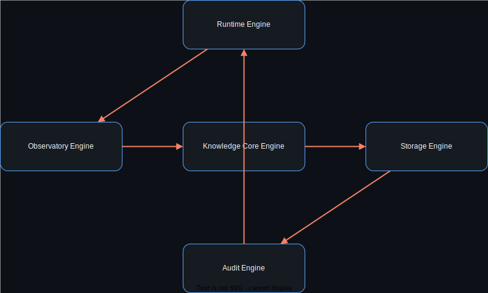
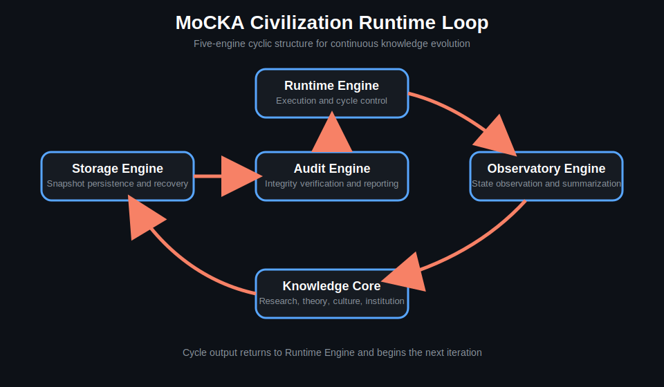
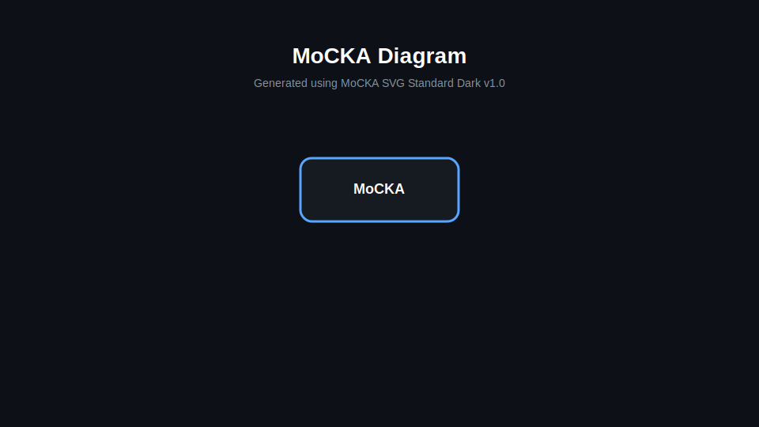
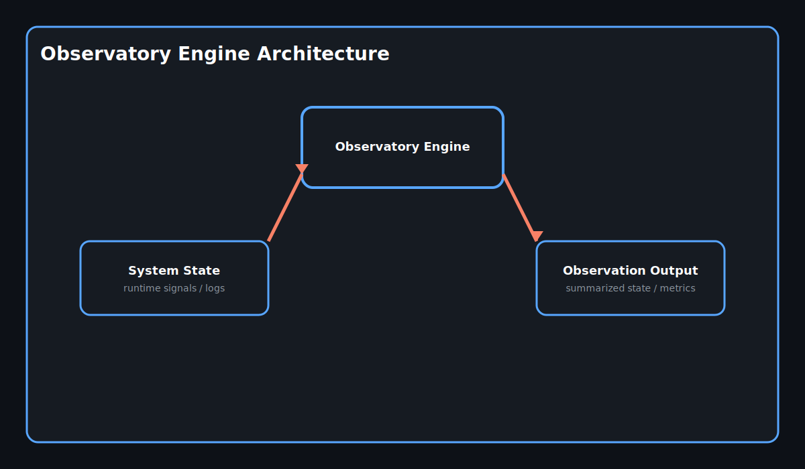
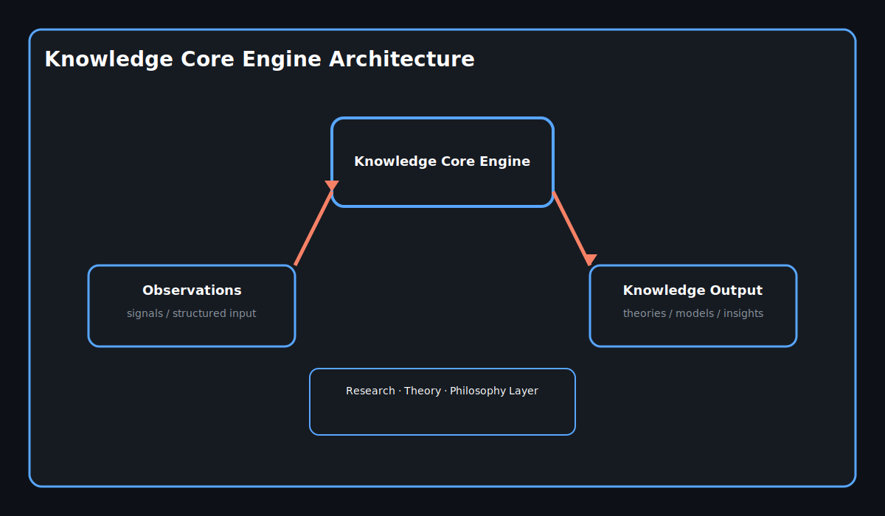
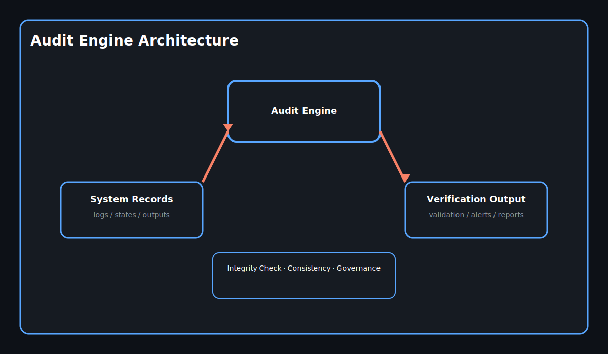
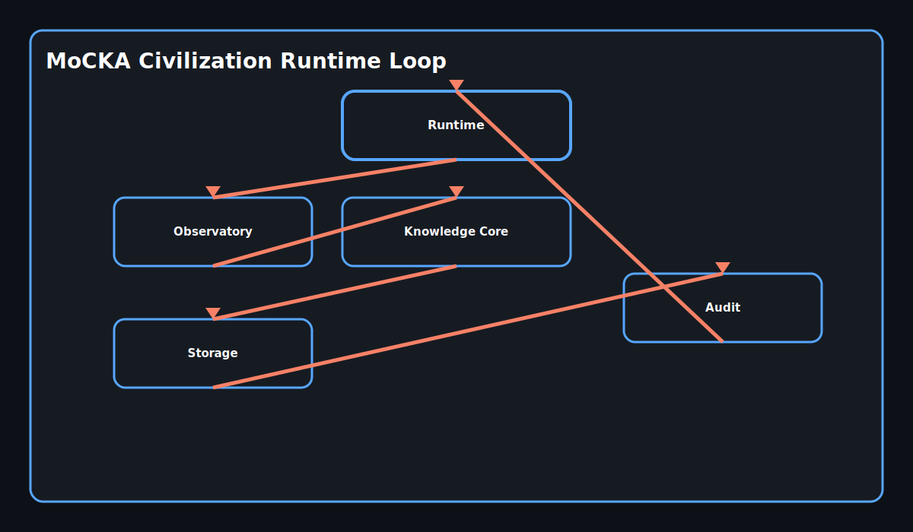
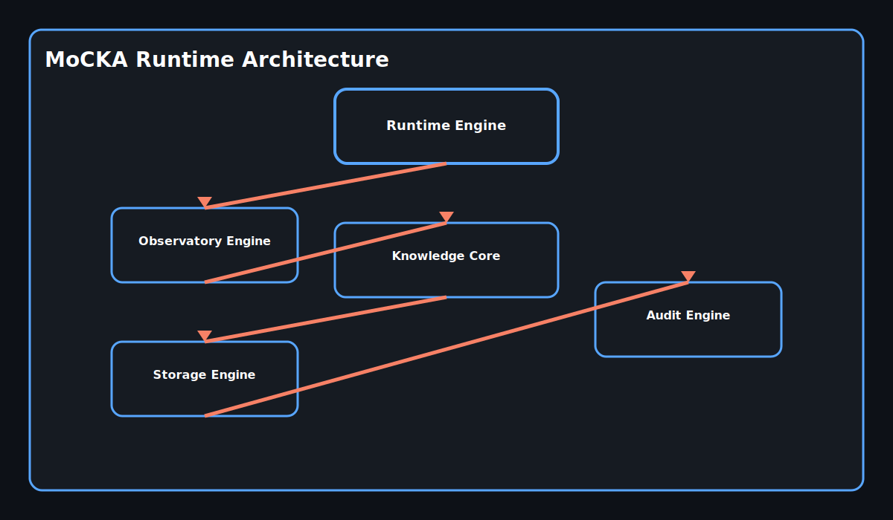

# MoCKA v4

Verifiable Governance Architecture

---

## English Version

### 1. Introduction

MoCKA v4 is a deterministic and cryptographically verifiable governance architecture designed for AI-assisted systems.

Unlike conventional AI systems that rely on implicit state and opaque processes, MoCKA replaces all hidden structures with explicitly defined, sealed artifacts.

This enables reproducibility, auditability, and institutional continuity across the entire system.

---

### 2. Core Principles

MoCKA is governed by the following foundational principles:

- No Hidden State
- Deterministic Artifacts
- Signed Commits
- Explicit Layer Separation
- Reproducibility by Policy

These principles define not only system behavior but also the conditions under which knowledge is considered valid.

---

### 3. System Overview

MoCKA is not a single application.  
It is a structured research ecosystem designed to simulate and study the architecture of an artificial civilization.

The system models how knowledge is generated, verified, preserved, and governed over time.

---

### 4. Civilization Layers

MoCKA is composed of five conceptual layers:

Research Layer  
Transparency Layer  
Network Layer  
Civilization Core Layer  
Runtime Layer

Each layer represents a distinct institutional role within the lifecycle of knowledge.

---

### 5. Repository Structure

The MoCKA ecosystem is distributed across multiple repositories:

MoCKA  
mocka-civilization  
mocka-knowledge-gate  
mocka-transparency  
mocka-outfield  
mocka-core-private

Each repository corresponds to a functional domain within the civilization architecture.

---

### 6. Philosophy

MoCKA explores the structure of AI civilization systems, focusing on:

- Governance
- Consensus formation
- Institutional memory
- Knowledge verification

The goal is not to optimize performance, but to construct systems in which knowledge remains reliable over time.

---

### 7. Architecture Diagrams

The following diagrams are generated artifacts and follow the **MoCKA SVG Standard Dark v1.0**.

#### MoCKA Runtime Architecture

#### Runtime Loop

#### Engine Architecture

Runtime Engine  

Observatory Engine  

Knowledge Core  

Storage Engine  

Audit Engine  

---

### 8. Ecosystem Architecture

#### MoCKA Ecosystem

#### Civilization Layer Model

---

### 9. Artifact Policy

All diagrams in this repository follow a strict generation policy:

drawio (source of truth)  
→ SVG (generated artifact)  
→ README (representation layer)

SVG files must not be manually edited.  
All changes must originate from drawio source files.

This guarantees consistency and reproducibility.

---

### 10. Conclusion

MoCKA is not an AI model.

It is a framework for constructing verifiable knowledge systems that behave as a civilization.

---

## 日本語版

### 1. 概要

MoCKA v4 は、AI支援システムのために設計された決定論的かつ暗号学的に検証可能なガバナンス・アーキテクチャです。

従来のAIシステムが暗黙的状態や不透明な処理に依存するのに対し、MoCKAはすべての隠れた構造を明示的に定義された封印済み成果物へ置き換えます。

これにより、再現性・監査性・制度的継続性がシステム全体で保証されます。

---

### 2. 基本原則

MoCKAは以下の原則に基づいて構築されています。

- 隠れた状態を持たない
- 決定論的成果物
- 署名付きコミット
- 明示的なレイヤー分離
- ポリシーによる再現性

これらの原則は、システムの挙動と知識の正当性の条件を定義します。

---

### 3. システム概要

MoCKAは単一のアプリケーションではありません。  
人工文明の構造を研究・再現するための分散型研究エコシステムです。

知識が生成・検証・保存・統治されるプロセスをモデル化します。

---

### 4. 文明レイヤー

MoCKAは以下の5つのレイヤーで構成されています。

研究層  
透明性層  
ネットワーク層  
文明コア層  
ランタイム層

各レイヤーは知識のライフサイクルにおける制度的役割を担います。

---

### 5. リポジトリ構造

MoCKAエコシステムは複数のリポジトリで構成されます。

MoCKA  
mocka-civilization  
mocka-knowledge-gate  
mocka-transparency  
mocka-outfield  
mocka-core-private

各リポジトリは文明構造の機能単位に対応します。

---

### 6. 哲学

MoCKAは以下の要素を中心にAI文明を研究します。

- ガバナンス
- 合意形成
- 制度的記憶
- 知識検証

目的は性能最適化ではなく、長期的に信頼可能な知識体系の構築です。

---

### 7. アーキテクチャ図

以下の図は **MoCKA SVG Standard Dark v1.0** に基づく生成成果物です。

#### ランタイム構造

#### ランタイムループ

#### エンジン構造

ランタイムエンジン  

観測エンジン  

知識コア  

ストレージエンジン  

監査エンジン  

---

### 8. エコシステム構造

#### エコシステム

#### 文明レイヤーモデル

---

### 9. 成果物ポリシー

すべての図は以下の生成フローに従います。

drawio（正本）  
→ SVG（生成物）  
→ README（表示）

SVGの直接編集は禁止されています。  
すべての変更はdrawioから生成される必要があります。

これにより一貫性と再現性が保証されます。

---

### 10. 結論

MoCKAは単なるAIではありません。

文明として振る舞う検証可能な知識システムのためのフレームワークです。

---

## Architecture

## Architecture

### Civilization Runtime Loop

### Runtime Overview

### Engines

#### Observatory

#### Knowledge Core

#### Storage

#### Audit

