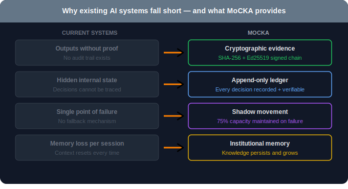
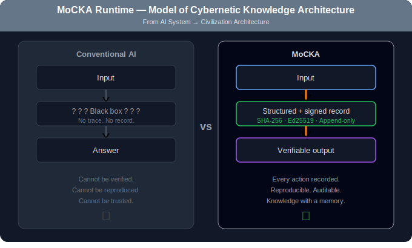
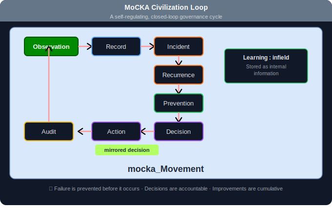
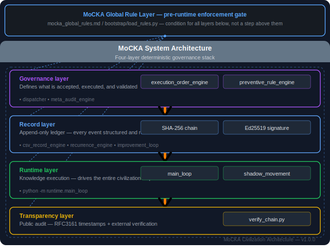
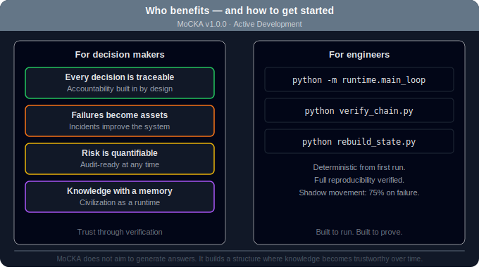

# MoCKA — Model of Cybernetic Knowledge Architecture

<p align="center">
  <a href="docs/images/mocka_overview.svg">
    
  </a>
</p>

> **MoCKA is not a system. It is a civilization model.**  
> Every action is recorded. Every decision is verified. Every failure becomes an asset.
>
> MoCKA transforms every AI decision from a one-time response into cryptographically sealed,
> reproducible institutional memory — so knowledge accumulates, failures become assets,
> and every decision remains auditable forever.
>
> This is not a logging tool. Not a framework. Not a wrapper.
> It is a deterministic governance architecture with a second heartbeat:
> even under failure, **shadow_Movement** ensures knowledge circulation never stops.

---

## What is MoCKA?

<p align="center">
  
</p>

Most AI systems generate answers.  
MoCKA builds a structure where knowledge becomes **trustworthy over time**.

MoCKA is a deterministic, verifiable architecture that models how a knowledge-generating civilization operates.  
Instead of relying on hidden internal state, MoCKA transforms all processes into:

- **Structured records** — every action leaves a trace
- **Append-only logs** — history cannot be silently altered
- **Auditable decisions** — every choice is accountable
- **Reproducible outcomes** — any state can be rebuilt from history

This is not just engineering.  
This is institutional memory for AI.

---

## Why It Matters

<p align="center">
  
</p>

| Traditional AI | MoCKA |
|---|---|
| Generates answers | Builds trustworthy knowledge |
| Forgets context | Preserves institutional memory |
| Black-box decisions | Fully auditable decision chains |
| Fails silently | Detects and records every anomaly |
| Starts fresh each session | Accumulates and evolves |

**Failures become assets.**  
Every incident is recorded, analyzed, and converted into a stronger system.

---

## How It Works — The Civilization Loop

<p align="center">
  
</p>

MoCKA operates as a closed-loop governance mechanism:
```
Observation → Record → Incident → Recurrence → Prevention → Decision → Action → Audit
      ↑                                                                          ↓
      └──────────────────── Learning : infield ◄─────────────────────────────────┘
```

This loop does not stop.  
Even under partial failure, MoCKA transitions into **Shadow Movement** —  
a reduced but stable mode that maintains approximately 75% operational capability.

---

## Architecture

<p align="center">
  
</p>

<p align="center">
  <a href="docs/images/mocka_governance_layer_perpetual_mechanism.svg">
    
  </a>
</p>

### mocka_Movement / shadow_Movement

MoCKA runs on a dual-path architecture:

- **mocka_Movement** — primary governance loop (normal operations)
- **shadow_Movement** — independent verification path (fallback operations)
- **shadow_Movement** ensures:
  - Knowledge circulation **never stops** — even under partial failure
  - Every primary output receives **independent verification**
  - System maintains **75% operational capability** in degraded mode
  - Feedback loops **cannot create irreversible deadlocks**

> shadow_Movement is not a backup. It is a second heartbeat.
> When the primary path fails, shadow_Movement absorbs the failure,
> preserves the evidence, and keeps the civilization loop running.

Every primary process is paired with a shadow verification path.  
The system never assumes correctness.


### acceptor:infield / acceptor:outfield

Once mocka_Receptor receives a stimulus, it routes to one of two paths:

| Path | Name | Role |
|------|------|------|
| Internal | `acceptor:infield` | Stores as internal memory · accumulates · feeds the loop |
| External | `acceptor:outfield` | Shares · publishes · proves to the outside world |

> infield = what the civilization remembers
> outfield = what the civilization shows

These are not storage locations. They are **roles**.
The same event can flow through both — stored internally AND published externally.

### Governance Layer

- `execution_order_engine` — controls execution sequencing
- `meta_audit_engine` — meta-level audit validation
- `dispatcher` — routes decisions to appropriate handlers
- `preventive_rule_engine` — prevents failures before they occur

### Record Layer

- SHA-256 hash chain — cryptographic integrity guarantee
- Ed25519 digital signatures — identity and authenticity
- Append-only ledger — tamper-evident history

### Core Runtime

- `main_loop` — single entry point for all operations
- `schema.py` — unified schema across all components
- `verify_all.py` — governance verification engine

---

## Verification Status

**Status:** `RESEARCH_RUN OK` — 20 verification checks passed.

<details>
<summary>View all 20 verification checks</summary>

1. **System Integrity Verification**
   - `movement_doctor_integrity`
   - `movement_structure_scan`
   - `canon_directory_integrity`
   - `artifact_directory_integrity`
   - `repo_entrypoints_present`
   - `repo_git_clean_check`
   - `repo_license_presence`

2. **Research Process Verification**
   - `experiments_minimum_coverage`
   - `research_registry_schema`
   - `research_map_registry_integrity`
   - `research_runner_selfcheck`

3. **Documentation Verification**
   - `readme_role_vocab_integrity`
   - `readme_research_entry_presence`
   - `docs_link_audit`

4. **Audit and Evidence Verification**
   - `gpg_signing_config_present`
   - `doctor_script_presence`
   - `doctor_artifact_schema`
   - `doctor_emit_json_artifact`
   - `doctor_sha_note_upsert`
   - `canon_notes_integrity`

</details>

---

## Entry Point — mocka_Receptor

Every interaction with MoCKA begins at a single point: **mocka_Receptor**.

The Receptor does not assume what the input is.
It receives any stimulus — human intent, AI output, event signal — and transforms it based on context.
Not 0 or 1. Not predetermined. It becomes what the system needs it to be.

```
External world
      ↓
mocka_Receptor          ← single entry point
      ↓              ↓
acceptor:infield   acceptor:outfield
(store · memory)   (share · publish)
      ↓
mocka_insight_system    ← mocka_Movement + shadow_Movement
```

---


---

## Getting Started — The simplest entry point

> This is not MoCKA. This is the door.
> MoCKA is what happens after you walk through it.

### Share — broadcast to all AIs instantly


### Collaborate — collect all responses, synthesize in Claude

## Prerequisites

- **Python 3.10+** — [Download](https://www.python.org/downloads/)
- **Git** — [Download](https://git-scm.com/)
- **Playwright** — Browser automation (Chromium)
- **Flask** — Local control panel
- **Windows** (PowerShell) / Mac / Linux

## Installation
```bash
git clone https://github.com/m-sirius-k/MoCKA.git
cd MoCKA
pip install -r requirements.txt
playwright install chromium
```
## Quick Start — 1 minute to your first civilization loop

### What happens in 60 seconds

```
Step 1 — Verify the system is intact
  $ mocka-check
  → LEDGER OK + ALL CHECKS PASSED

Step 2 — Run one loop cycle
  $ mocka-loop
  → Observation → Record → Incident → ... → Audit
  → 1 event sealed into ledger.json (SHA256 chain)

Step 3 — Confirm the record is sealed
  $ mocka-seal "my first event"
  → ANCHOR UPDATED AND COMMITTED
  → ALL CHECKS PASSED
```

> After these 3 steps, you have produced:
> - A cryptographically sealed event in `runtime/main/ledger.json`
> - A governance anchor in `governance/anchor_record.json`
> - A reproducible, verifiable record — forever.

### A single event — end to end

```
Human clicks "SAVE → infield" on the control panel
      ↓
mocka_Receptor receives the stimulus
      ↓
acceptor:infield stores it as a structured 5W1H event
      ↓
ledger.json seals it with SHA256 chain
      ↓
mocka-seal anchors it to governance/anchor_record.json
      ↓
verify_all confirms: ALL CHECKS PASSED
      ↓
The event is now part of institutional memory — forever.
```

### Full runtime commands

```powershell
# Health check — verify ledger + all governance checks
mocka-check

# Run one civilization loop cycle
mocka-loop

# Seal a decision into the ledger
mocka-seal "your message here"

# Verify the hash chain only
python verify_chain.py

# Run all governance checks
python verify_all.py
```
---

## Status

**v1.0.0 — Active Development**  
Civilization loop confirmed running.  
All 20 governance checks passing.

---

---

# MoCKA — モデル・オブ・サイバネティック・ナレッジ・アーキテクチャ

<p align="center">
  <a href="docs/images/mocka_overview.svg">
    
  </a>
</p>

> **MoCKAはシステムではありません。文明モデルです。**  
> すべての行動は記録される。すべての決定は検証される。すべての失敗は資産になる。

---

## MoCKAとは何か？

<p align="center">
  
</p>

多くのAIシステムは「答えを生成」します。  
MoCKAは「**時間とともに信頼できる知識を構築する**」構造を作ります。

隠れた内部状態に依存するのではなく、すべてのプロセスを以下に変換します：

- **構造化された記録** — すべての行動が痕跡を残す
- **追記専用ログ** — 履歴は静かに改ざんできない
- **監査可能な決定** — すべての選択に説明責任がある
- **再現可能な結果** — どの状態も履歴から再構築できる

これは単なるエンジニアリングではありません。  
AIのための制度的記憶です。

---

## なぜ重要か？

<p align="center">
  
</p>

| 従来のAI | MoCKA |
|---|---|
| 答えを生成する | 信頼できる知識を構築する |
| 文脈を忘れる | 制度的記憶を保持する |
| ブラックボックスの決定 | 完全に監査可能な決定チェーン |
| 静かに失敗する | すべての異常を検出・記録する |
| 毎回ゼロからスタート | 蓄積し、進化し続ける |

**失敗は資産になります。**  
すべてのインシデントが記録・分析され、より強固なシステムへと変換されます。

---

## 仕組み — 文明ループ

<p align="center">
  
</p>
```
観測 → 記録 → インシデント → 再発 → 予防 → 決定 → 行動 → 監査
 ↑                                                          ↓
 └─────────────────── 学習：インフィールド ◄─────────────────┘
```

このループは停止しません。  
部分的な障害が発生しても、**Shadow Movement**に移行し、  
約75%の稼働能力を維持した縮退モードで動作を継続します。

---

## アーキテクチャ

<p align="center">
  
</p>

<p align="center">
  <a href="docs/images/mocka_governance_layer_perpetual_mechanism.svg">
    
  </a>
</p>

### mocka_Movement / shadow_Movement

- **mocka_Movement** — 主統治ループ（通常運用）
- **shadow_Movement** — 独立検証経路（フォールバック運用）

### ガバナンスレイヤー

- `execution_order_engine` — 実行順序の制御
- `meta_audit_engine` — メタレベルの監査検証
- `dispatcher` — 決定のルーティング
- `preventive_rule_engine` — 障害の事前防止

### 記録レイヤー

- SHA-256ハッシュチェーン — 暗号学的完全性保証
- Ed25519デジタル署名 — 同一性と真正性
- 追記専用台帳 — 改ざん検知可能な履歴

### コアランタイム

- `main_loop` — すべての操作の単一エントリポイント
- `schema.py` — 全コンポーネント共通スキーマ
- `verify_all.py` — ガバナンス検証エンジン

---

## 検証ステータス

**検証結果:** `RESEARCH_RUN OK` — 20項目の検証すべて通過。

<details>
<summary>20項目の検証内容を表示</summary>

1. **システム整合性検証**
   - `movement_doctor_integrity`
   - `movement_structure_scan`
   - `canon_directory_integrity`
   - `artifact_directory_integrity`
   - `repo_entrypoints_present`
   - `repo_git_clean_check`
   - `repo_license_presence`

2. **研究プロセス検証**
   - `experiments_minimum_coverage`
   - `research_registry_schema`
   - `research_map_registry_integrity`
   - `research_runner_selfcheck`

3. **ドキュメント検証**
   - `readme_role_vocab_integrity`
   - `readme_research_entry_presence`
   - `docs_link_audit`

4. **監査・証跡検証**
   - `gpg_signing_config_present`
   - `doctor_script_presence`
   - `doctor_artifact_schema`
   - `doctor_emit_json_artifact`
   - `doctor_sha_note_upsert`
   - `canon_notes_integrity`

</details>

---

## クイックスタート

<p align="center">
  
</p>
```bash
python -m runtime.main_loop
python verify_chain.py
python verify_all.py
python rebuild_state.py
```

---

## ビジョン

- **記録される。** すべての行動が永続的で改ざん検知可能な痕跡を残す。
- **検証される。** すべての状態を第三者が独立して確認できる。
- **記憶される。** 知識が蓄積され、時間とともに複利的に成長する。
- **継承される。** システムはその履歴だけから完全に再構築できる。

---

## ステータス

**v1.0.0 — アクティブ開発中**  
文明ループ動作確認済み。  
ガバナンス20項目すべて通過。


