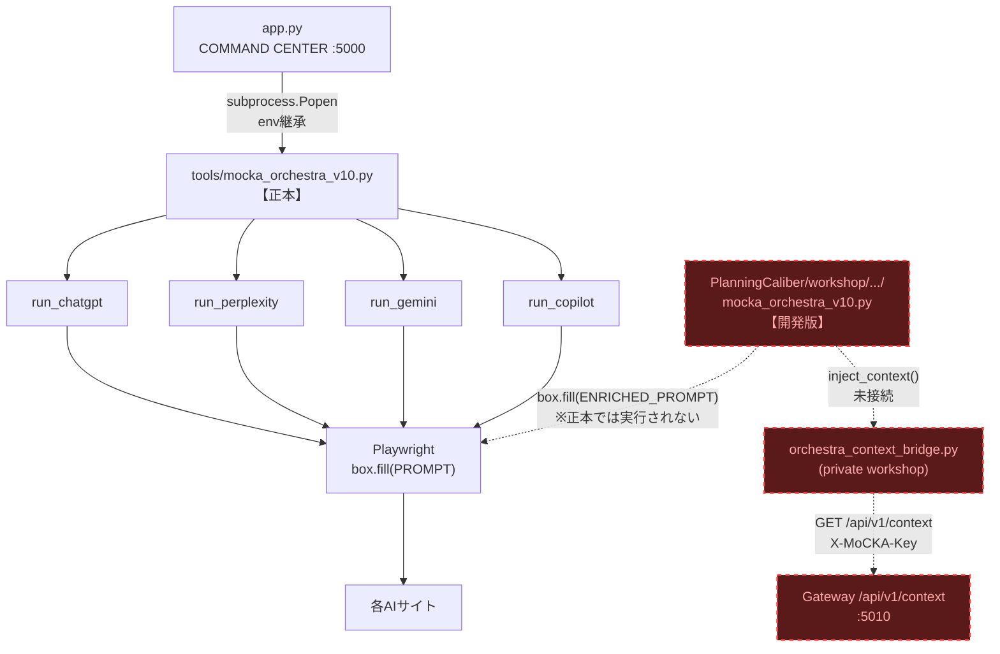

# Orchestra Architecture Audit v0.1

作成日: 2026-07-07
対応TODO: TODO_419(正本Orchestra監査)Phase F
根拠: DC_20260707_004

---

## 概要

TODO_419の監査(Phase A-C、DC_20260707_004)で確定した、Orchestra実行経路の現状構造を図示する。Context Injection(TODO_258)は正本コードパス上では未接続であることを明示する。

---

## 現状の構造図

凡例: 赤破線 = 現状「未接続」(private workshop側にのみ存在し、正本コードパスからは呼ばれない)。

---

## 経路別の状態

| 区間 | 状態 | 根拠 |
|---|---|---|
| app.py → tools/mocka_orchestra_v10.py | 接続済み | subprocess.Popen実行を確認(app.py:614, 667) |
| tools/mocka_orchestra_v10.py → Playwright → 各AI | 接続済み・稼働確認済み | 2026-07-07 E2Eテストで実送信・応答を実地確認 |
| tools/mocka_orchestra_v10.py → orchestra_context_bridge.py | **未接続** | tools版はorchestra_context_bridgeを一切importしない(DC_20260707_004) |
| orchestra_context_bridge.py → Gateway /api/v1/context | 接続済み(開発版内でのみ) | private workshop版で実装済み、Gateway側もX-MoCKA-Key受理を実地確認済み(E20260707_7923852861d9b) |
| 開発版mocka_orchestra_v10.py → Playwright | 未使用 | app.pyから起動されない(正本ではないため) |

---

## 結論(DC_20260707_004より)

Context Injection機能自体(Bridge・Gateway側)は正しく動作するが、**正本のOrchestra実行スクリプトがこの機能を呼び出していない**ため、実運用では一度も注入が発生していない。統合方針は、正本の複数セレクターフォールバック実装を維持したまま、`inject_context`統合部分のみを正本へ部分移植すること(詳細はDC_20260707_004参照)。

実装(コード変更)は本監査の範囲外。Human Gate承認を経てから着手する。
